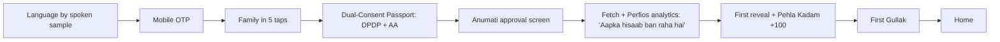

# App flow

## Tabs
| Tab | Route | Holds |
|---|---|---|
| 🏠 Ghar / Home | `/` | Aaj ka kaam, Safe-to-Spend, cash river, jars, health tiles, Agar…?, mission, donut |
| 🎯 Lakshya / Goals | `/goals` | Gullak jars, missions, Shock Simulator |
| 🎤 Poocho / Ask | `/ask` | Voice companion: Kyon? / Agar…? |
| 🏆 Inaam / Rewards | `/rewards` | Points, streak, level tree, badges, family leaderboard, Value Ledger, lessons |
| 👤 Parivaar / Family | `/family` | Members + sharing, Consent Passport, revoke, literacy mode, demo households, sponsor status, help |

## First-time flow (target < 4 min) — `/onboarding`


## Consent sequence (Anumati + Perfios)
```mermaid
sequenceDiagram
  participant U as Family (PWA)
  participant API as DhanYukti API
  participant AA as Anumati AA
  participant PF as Perfios
  U->>API: POST /consent/aa/start
  API->>AA: create consent (purpose, FI types, 6m, monthly, 90d)
  API-->>U: redirect_url
  U->>AA: discover/link accounts, approve
  AA-->>API: callback (then we poll status)
  API->>AA: FI data request
  AA-->>PF: encrypted FI data
  PF-->>API: decrypted data + categories
  API->>API: E01 normalise, Twin, delete raw < 24h
  U->>API: revoke → API->>AA: revoke; wipe derived profile
```

## Daily loop (30 s)
Nudge "Aaj ka kaam taiyaar hai" → Home card → Kyon? or Karo → confirm (High Stakes Gate read-back) → points + streak animation.

## Monthly loop
Salary credit → Gullak sweep nudge → month-end review (saved, avoided, mission) → re-fetch under existing consent → refreshed plan.

## Action lifecycle
proposed → confirmed → handed off → done | failed. "Done" is user-reported unless evidenced by the next AA fetch. Only evidenced outcomes enter the Value Ledger.
