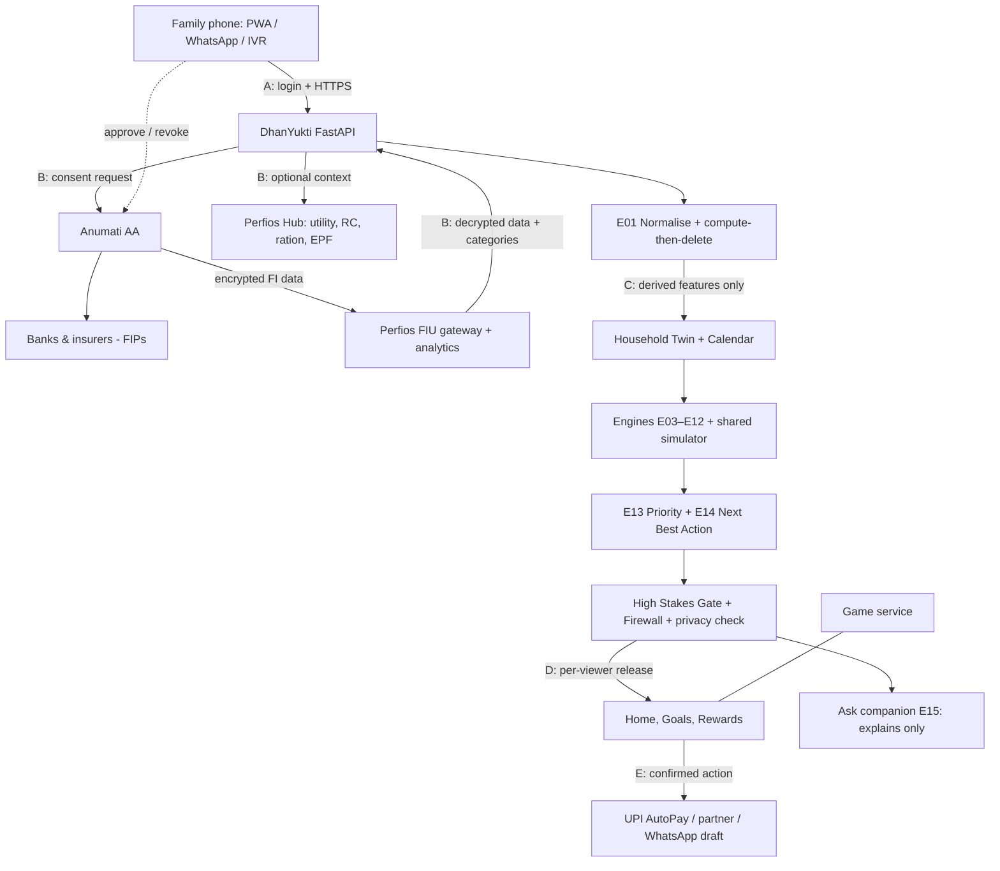

# Technical specifications

## Architecture — modular monolith

A–E are trust boundaries.

## Repo layout
```
docs/                 this folder
web/                  Next.js 16 PWA (App Router, TS, Tailwind v4, motion, lucide-react)
  src/app/            routes: / onboarding goals ask rewards family anumati
  src/components/     ui/ (sheets, dial, river, donut…) art/ (SVG illustrations)
  src/lib/            types.ts (mirror of API contract), api.ts, format.ts, i18n
api/                  FastAPI
  app/engines/        e01 e03 e04 e05 e06 e13 e14 e16 — pure functions
  app/connectors/     base.py, anumati/{client,replay}, perfios/{client,replay}
  app/game/           points, streaks, levels, badges, ledger
  app/routers/        households consent game ask meta
  app/fixtures/       golden households A/B/C + redacted replay fetch
  tests/
```

## Stack
| Layer | Tool | Notes |
|---|---|---|
| Client | Next.js 16 PWA, TypeScript, Tailwind v4 | `/api/*` proxied to FastAPI via rewrites (`API_ORIGIN`) |
| Animation | `motion` | jar fill, streak flame, confetti |
| Charts | Hand-built SVG | cash river, dial, donut — no chart lib, keeps bundle small |
| Voice | Web Speech API (demo) → Bhashini (prod) | read back amount + date before any action |
| Backend | FastAPI + Pydantic v2 + HTTPX | engines pure; money in paise |
| Data | In-memory store (prototype) → Supabase Postgres + RLS | separate game tables |
| Jobs | Postgres outbox + worker (prod) | monthly fetch, salary-day trigger, nudges |
| AI | Optional Claude via provider adapter | tools: get_decision, simulate_cashflow, simulate_shock |
| Messaging | wa.me click-to-chat (demo) → WhatsApp Business API | |
| Hosting | Vercel (web) + Render/Railway (API) | India region where available |

## Engines
| ID | Name | Output |
|---|---|---|
| E01 | Normalise | income sources, EMIs, app-loan cycles, bills, penalties, cash share |
| E03 | Cash flow simulator | 30-day river, min balance, gap; scenario branches |
| E04 | Debt + Lender Shield | debt load per ₹100; RBI DLA check; effective annual cost |
| E05 | Resilience | days of essentials without income |
| E06 | Protection | life / health per earner |
| E13 | Priority | ranked needs |
| E14 | Next Best Action | bilingual cards + Why packet + action |
| E16 | Confidence | pakka / andaaza / pata_nahi |

## Performance budget
First load < 1.5 MB · animations < 200 KB · works on 3G · skeleton loading · offline cache for non-sensitive screens only.
